# Capítulo IV: Product Design
## 4.1. Style Guidelines
### 4.1.1. General Style Guidelines
El diseño visual de Greenlogist debe reflejar sus valores fundamentales: sostenibilidad, eficiencia, confianza y conexión directa entre productores y consumidores conscientes. Adicionalmente, deberá presentar un diseño limpio, con espacios amplios, buena jerarquía visual, alto contraste en botones, textos legibles, íconos comprensibles y una estética amigable pero profesional.

### **Colores**
Los colores escogidos para este producto fueron: Un Verde Natural (#4CAF50) como color principal, el cual refleja sostenibilidad, frescura y es fuertemente asociado con el campo; Beige claro (#F5F5DC) para el fondo de la página; Gris suave (#E0E0E0) para elementos secundarios de la página; Verde oscuro (#2E7D32) para los botones y elementos llamativos; y Negro (#212121) para la tipografía.

### **Tipografía**
Para la tipografía de la página se eligió Montserrat Bold para los titulares, esto debido a su caracter moderno y a que facilita la legibilidad para el usuario. Asimismo, se hará uso de la tipografía Open Sans Regular para el cuerpo del texto debido a sus accesibilidad. 

### **Tono y comunicación**
La página debe presentar un tono claro, sencillo y positivo, que refleja la personalidad de la marca (confiable, accesible, moderna y comprometida con el cambio). Asimismo, el tono debe estar enfocado en los beneficios del comercio justo, el respeto por el medio ambiente y la colaboración entre actores.

### **Iconografía**
Se emplearán íconos lineales, y minimalistas, relacionados a la agricultura, transporte, geolocalización, sostenibilidad, calificación y contacto.Es importante priorizar su uso moderado para no saturar visualmente, pero sí facilitar la comprensión rápida de funciones.

### 4.1.2. Web Style Guidelines
Las guías de estilo web de Greenlogist aseguran una experiencia visual y funcional coherente, centrada en la usabilidad, accesibilidad y conexión con el usuario. Se alinean con los principios de diseño sostenible, simplicidad funcional y diseño centrado en el usuario.

Se empleará un diseño basado en grid de 12 columnas para flexibilidad y adaptabilidad responsiva.

Asimismo, se deberán asegurar márgenes amplios y separación clara entre secciones para evitar saturación visual.

Adicionalmente, el encabezado siempre visible con logo, buscador, categorías y acceso rápido a cuenta/perfil, y se debe establecer un pie de página con enlaces a contacto, redes sociales y certificado de sostenibilidad.

## 4.2 Information Architecture
La arquitectura de la información para Greenlogist se ha estructurado de manera clara y coherente para garantizar una navegación intuitiva tanto en la **Landing Page** como en las **Web Applications** para productores y consumidores. Se ha priorizado la facilidad de acceso a las funcionalidades principales según los perfiles de usuario.

### 4.2.1 Organization Systems

En esta sección, el equipo explica en qué grupos de información aplicará cuáles sistemas de organización. Se incluye la explicación de en qué casos se aplicará la organización visual del contenido: de forma jerárquica (visual hierarchy), organización secuencial (step-by-step to accomplish) o matricial.

**Landing Page:**
*   **Organización jerárquica:** La información se estructura de forma descendente: desde la presentación general de Greenlogist, los beneficios, funciones del producto, los planes hasta los llamados a la acción para registro e inicio de sesión.

**Web Applications:**
*   **Productores:**
    *   **Organización jerárquica:** Dashboard con acceso directo a funciones clave como Productos, Solicitar Transporte y Estadísticas.
    *   **Organización secuencial:** Creación de un producto nuevo (llenado de formulario paso a paso).
    *   **Organización matricial:** Acceso cruzado entre Productos y Solicitudes de Transporte para gestionar logística de forma integral.
        
*   **Consumidores:**
    *   **Organización jerárquica:** Pantalla de inicio con categorías de productos en orden de prioridad.
    *   **Organización secuencial:** Flujo de compra: selección de productos → carrito → pago → seguimiento.
    *   **Organización matricial:** Posibilidad de navegar entre Productos, Perfil del Productor, y Métricas Ambientales sin perder el contexto.
        
### 4.2.2 Labeling Systems
**Landing Page:**
*   Menú principal con etiquetas claras: "Inicio", "Para Productores", "Para Consumidores", "Beneficios", "Regístrate", "Iniciar Sesión".
*   Botones de acción llamativos como "Únete como Productor" y "Compra Productos Orgánicos".
    
**Web Applications:**
*   Menú personalizado dependiendo del perfil.
*   Etiquetas simples y orientadas a la acción, por ejemplo:
    *   "Añadir Producto"
    *   "Solicitar Transporte"
    *   "Mis Estadísticas"
    *   "Carrito"
    *   "Seguimiento de Pedido"
    *   "Reseñar Pedido"
        
### 4.2.3 SEO Tags and Meta Tags

**Landing Page:**
*   Títulos y meta descripciones optimizados para palabras clave como "Beneficios", "Planes", "Características".
*   Etiquetas Open Graph para mejor visualización en redes sociales.
    
**Web Applications:**
*   Páginas internas optimizadas para búsquedas específicas como "comprar productos orgánicos en Perú" o "distribuir productos ecológicos".
*   Etiquetas específicas por tipo de usuario.
    
### 4.2.4 Searching Systems
**Landing Page:**
*   No requiere buscador interno debido a su enfoque informativo.

**Web Applications:**
*   **Consumidores:**
    *   Buscador de productos por nombre, categoría o productor.
    *   Filtros por tipo de producto, certificaciones, precios y distancia de entrega.
        
*   **Productores:**
    *   Buscador interno para gestión de productos.

### 4.2.5 Navigation Systems
**Landing Page:**
*   Menú principal fijo y accesible en todo momento.
*   Botones directos hacia registro.
    
**Web Applications:**
*   **Productores:**
    *   Menú superior persistente.
    *   Acceso rápido a creación de productos, solicitudes de transporte y estadísticas.
        
*   **Consumidores:**
    *   Menú superior con acceso a Home, Carrito, Seguimiento y Perfil.
    *   Breadcrumbs para regresar al catálogo desde páginas de detalle de producto.

## 4.3. Landing Page UI Design
### 4.3.1. Landing Page Wireframe
Aquí se mostrarán los wireframes para cada sección presente en nuestra lannding page.

### 4.3.1. Landing Page Mockup
En esta sección se mostrará los mockups para nuestra landing, tomando en cuenta las pautas de estilo anteriormente detalladas.

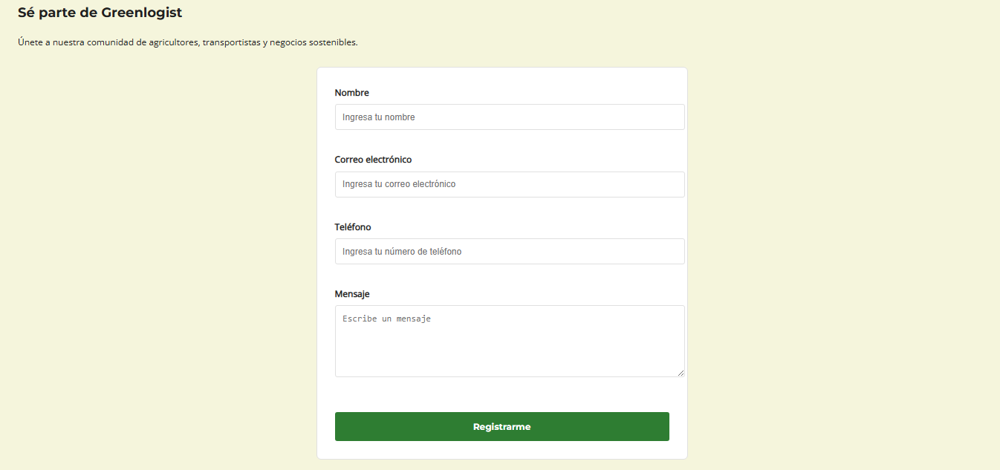

## 4.4. Web Applications UX/UI Design
### 4.4.1. Web Applications Wireframes

**Web Apps / Productores:**
En esta sección se muestra los wireframes pertenecientes al inicio de sesión como **PRODUCTOR**

**Web Apps / Consumidores:**
En esta sección se muestra los wireframes pertenecientes al inicio de sesión como **CONSUMIDOR**

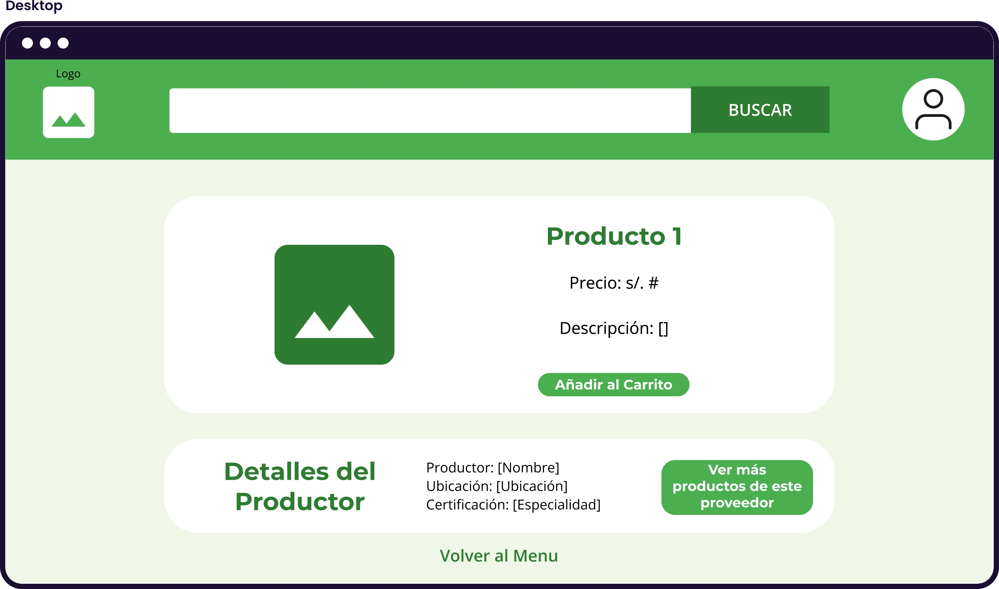

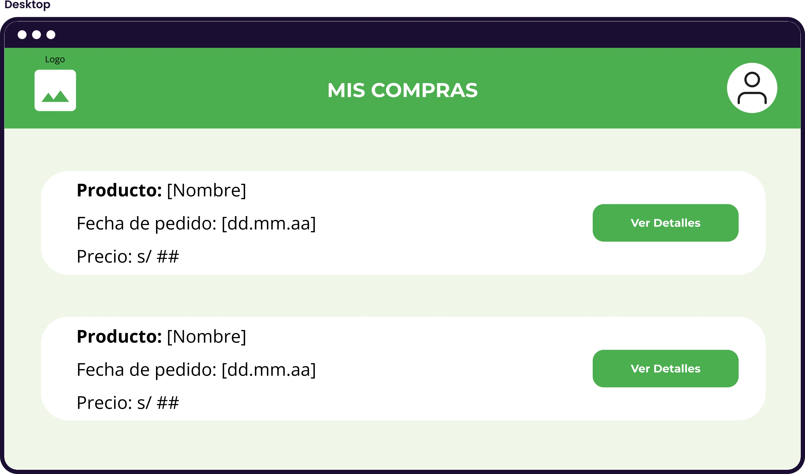

Trabajado en Figma: [Enlace](https://www.figma.com/design/41WDtKvsAEetkbWrcTch0w/Greenlogist---Web-Applications?node-id=1-188&t=qb4RQlPHM32wWfRl-1)

### 4.4.2. Web Applications Wireflow Diagrams
A continuación se detallarán los Wireflow Diagrams para los usuarios Productores y Consumidores de nuestro programa. Esto se analizó tomando en cuenta las User Stories y las necesidades que los usuarios podrían presentar al visitar nuestro servicio.

Trabajado en LucidChart: [Enlace](https://lucid.app/lucidchart/54c96a10-3216-4c5f-b835-e9b68dfa344d/edit?viewport_loc=-4198%2C-4351%2C17026%2C7722%2C0_0&invitationId=inv_763ccd35-1062-4c3d-a52b-e2b3bf55825b)

**Wireflow Diagram Productores**

**Wireflow Diagram Consumidores**

### 4.4.3. Web Applications Mock-ups

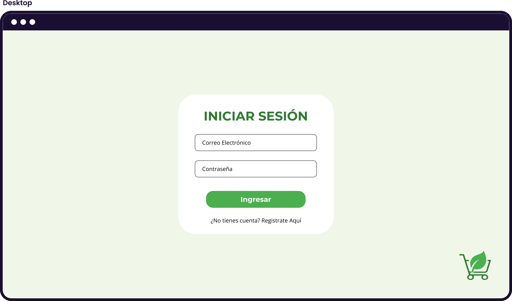

**Web Apps / Productores:**
En esta sección se detallan los mockups pertenecientes al inicio de sesión como **PRODUCTOR**, ahora siguiendo las pautas anteriormente detalladas en el estilo que la página adoptaría.

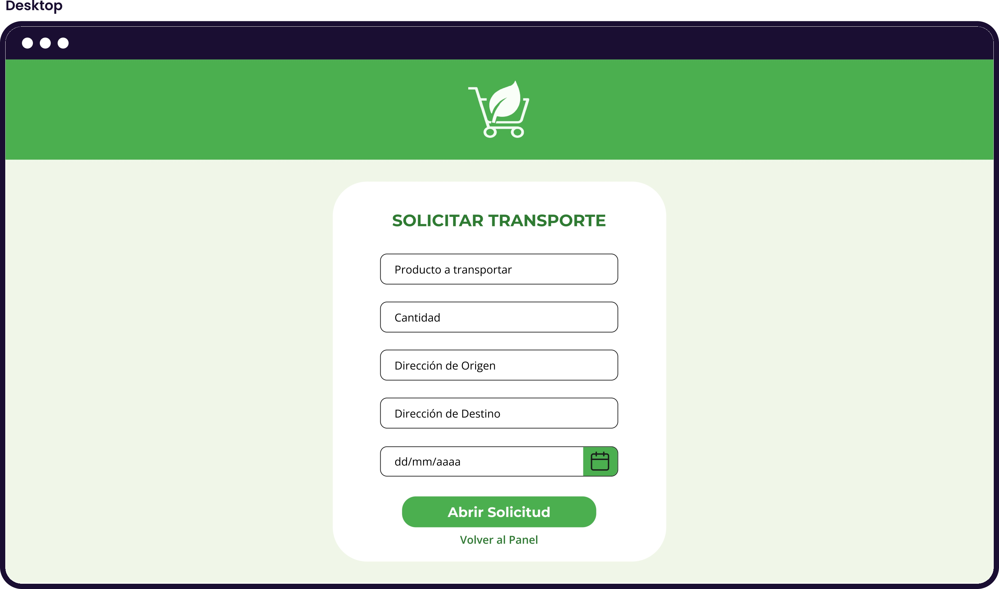

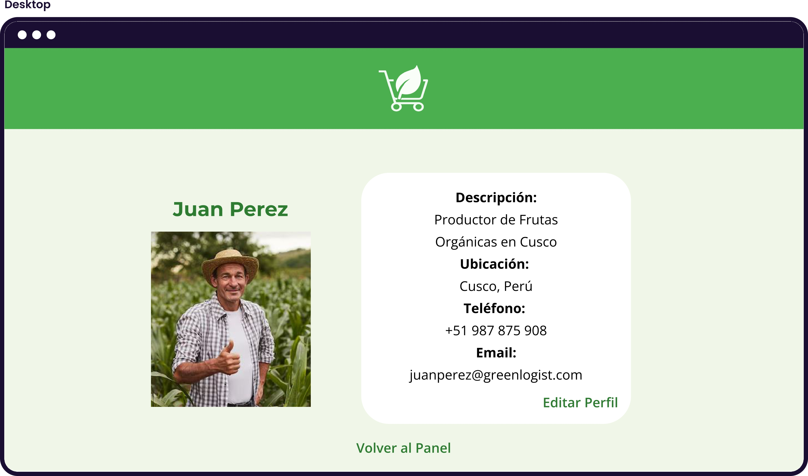

**Web Apps / Consumidores:**
En esta sección se detallan los mockups pertenecientes al inicio de sesión como **CONSUMIDOR**, ahora siguiendo las pautas anteriormente detalladas en el estilo que la página adoptaría.

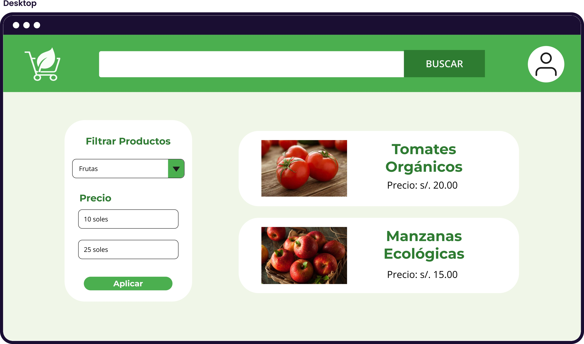

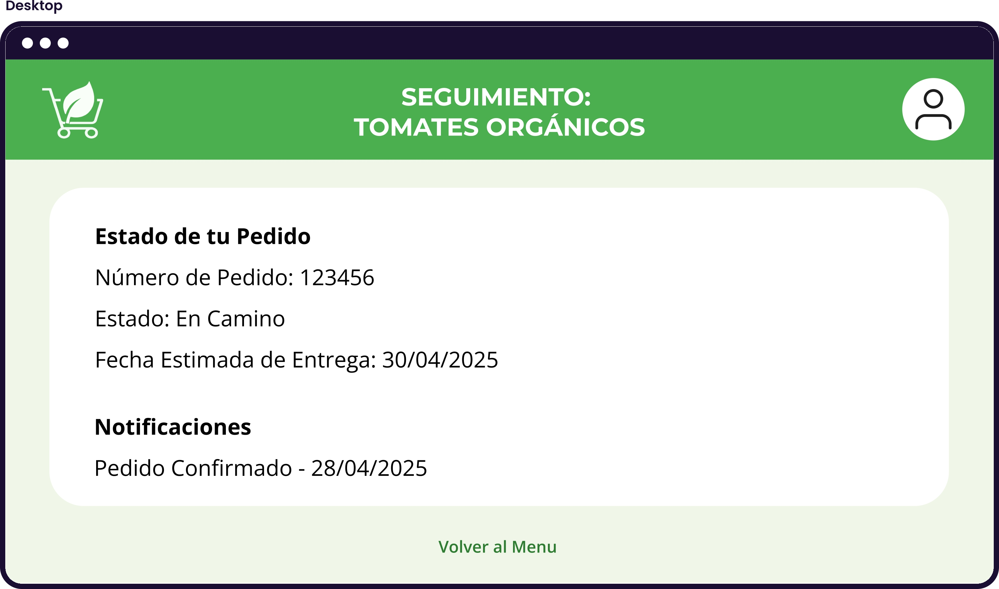

Trabajado en Figma: [Enlace](https://www.figma.com/design/41WDtKvsAEetkbWrcTch0w/Greenlogist---Web-Applications?node-id=1-188&t=qb4RQlPHM32wWfRl-1)

### 4.4.4. Web Applications User Flow Diagrams

**User Flow: Productores**

User Goal: Como productor, quiero gestionar mis productos, organizar la logística de transporte, ver estadísticas de ventas, y mantener actualizado mi perfil público.

**Descripción del flujo:**

**Happy Path:** El productor inicia sesión, ingresa a su dashboard, añade o edita productos, gestiona solicitudes de transporte, consulta sus estadísticas, y actualiza su perfil si desea.

**Unhappy Paths:**

Error al agregar producto → muestra mensaje de error, permite corregir datos.

Transporte no disponible → opción para reagendar transporte.

Métricas bajas → recibe sugerencias de mejora.

**User Flow: Consumidores**

User Goal: Como consumidor, quiero buscar productos, agregarlos al carrito, realizar la compra y hacer seguimiento de mi pedido.

**Descripción del flujo:**

**Happy Path:** El consumidor inicia sesión, navega por el catálogo, filtra o busca productos, selecciona uno, lo añade al carrito, procede al pago y recibe confirmación. Luego puede hacer seguimiento de su pedido y dejar una reseña al final.

**Unhappy Paths:**

No encuentra producto → puede refinar la búsqueda o navegar de nuevo.

Error de pago → puede reintentar con otro método de pago.

Pedido Cancelado → se muestra aviso y opción de reintentar compra.

## 4.5. Web Applications Prototyping

## 4.6. Domain-Driven Software Architecture

### 4.6.1. Software Architecture Context Diagram

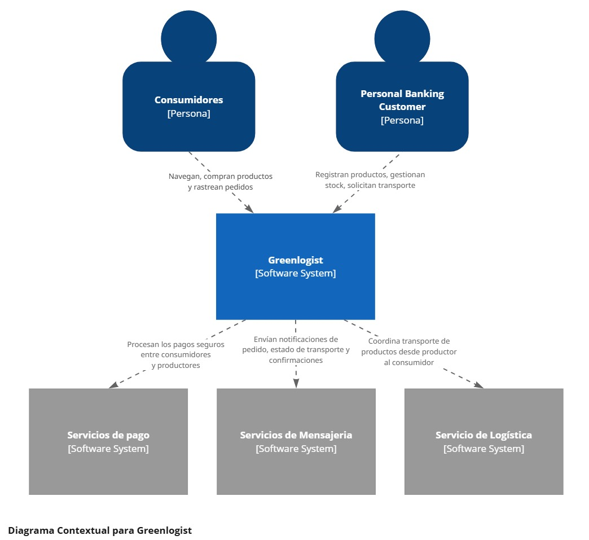

### 4.6.2. Software Architecture Container Diagrams

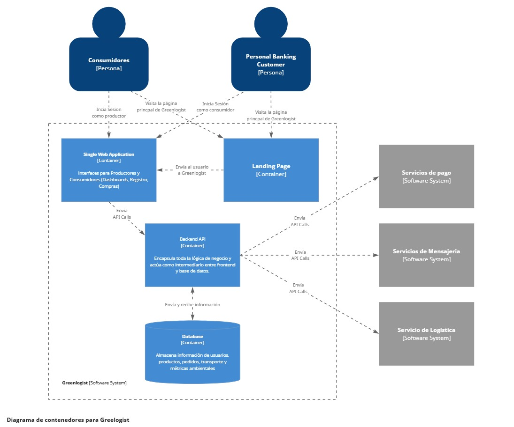

### 4.6.3. Software Architecture Components Diagrams

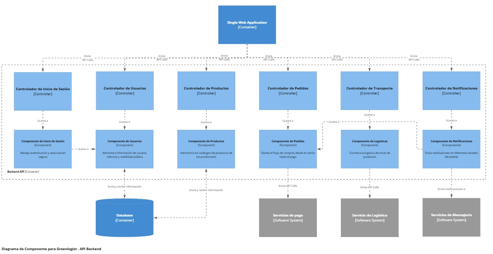

## 4.7. Software Object-Oriented Design

### 4.7.1. Class Diagrams

### 4.7.2. Class Dictionary
**1. Class Structure**

| Componente        | Ejemplo de Sintaxis          | Descripción                         |
| :---------------- | :--------------------------- | :---------------------------------- |
| **Nombre de Clase**| `class Usuario`               | Nombre principal de la clase.       |
| **Atributos**      | `+id: UUID`                   | Variables o campos de la clase. `+` = público. |
| **Métodos**        | `+solicitarTransporte(): void`| Funciones o comportamientos de la clase. |
| **Separador**      | `--`                          | Línea que divide atributos de métodos. |

**2. Visibility  Modifiers**

| Símbolo | Significado  | Ejemplo                |
| :------ | :----------- | :--------------------- |
| `+`     | Público       | `+nombre: String`       |
| `-`     | Privado       | `-contraseña: String`   |
| `#`     | Protegido     | `#saldo: Decimal`       |
| `~`     | Paquete       | `~token: String`        |

**3. Data Types**

| Tipo         | Ejemplo                       | Notas                        |
| :----------- | :---------------------------- | :--------------------------- |
| Primitivos   | `String`, `Int`, `Decimal`, `Text` | Tipos básicos del lenguaje.  |
| Personalizados | `UUID`, `Timestamp`, `Enum`   | Tipos definidos en el sistema. |
| Colecciones  | `List<Producto>`, `List<HistorialReseñas>` | Relaciones de tipo múltiple (`*`). |

**4. Relationships**

| Tipo de Relación | Sintaxis (Mermaid)                       | Ejemplo de Descripción                                  | Significado                    |
| :--------------- | :--------------------------------------- | :----------------------------------------------------- | :----------------------------- |
| **Asociación**   | `Usuario --> SolicitudTransporte`         | Un usuario realiza múltiples solicitudes de transporte. | Vínculo general.               |
| **Agregación**   | `Producto o-- HistorialReseñas`           | Un producto puede tener muchas reseñas, pero no depende de ellas para existir. | Contención débil.              |
| **Composición**  | `SolicitudTransporte *-- SeguimientoEnvio`| Cada solicitud de transporte **posee** un seguimiento asociado; si la solicitud desaparece, también el seguimiento. | Contención fuerte (lifecycle). |
| **Dependencia**  | `Carrito ..> Producto`                   | El carrito **depende** temporalmente del producto para calcular precios. | Uso temporal.                  |
| **Asociación**   | `Usuario --> Carrito`                     | Un usuario puede tener uno o varios carritos.            | Vínculo general.               |
| **Asociación**   | `Producto --> EstadisticasPanel`          | Cada producto tiene un panel de estadísticas asociado.  | Vínculo general.               |

**5. Multiplicity (Cardinality)**

| Notación | Significado         | Ejemplo (Mermaid)                    |
| :------- | :------------------ | :----------------------------------- |
| `1`      | Exactamente uno      | `Producto "1" -- "1" EstadisticasPanel` |
| `*` o `n`| Muchos (cero o más)   | `Usuario "1" -- "*" SolicitudTransporte` |
| `0..1`   | Cero o uno (opcional) | `Carrito "0..1" -- "1" Usuario` |
| `1..*`   | Uno o más             | `SolicitudTransporte "1" -- "1..*" SeguimientoEnvio` |

**6. Notes & Stereotypes**

| Elemento          | Sintaxis                               | Ejemplo                         |
| :---------------- | :------------------------------------- | :------------------------------ |
| **Nota**          | `note for Producto: "El stock puede cambiar con el tiempo"` | Agrega comentarios o aclaraciones a una clase. |
| **Estereotipo**   | `<<Entidad>> Usuario`                   | Marca que es una entidad del dominio. |

## 4.8. Database Design.

### 4.8.1. Database Diagram.

