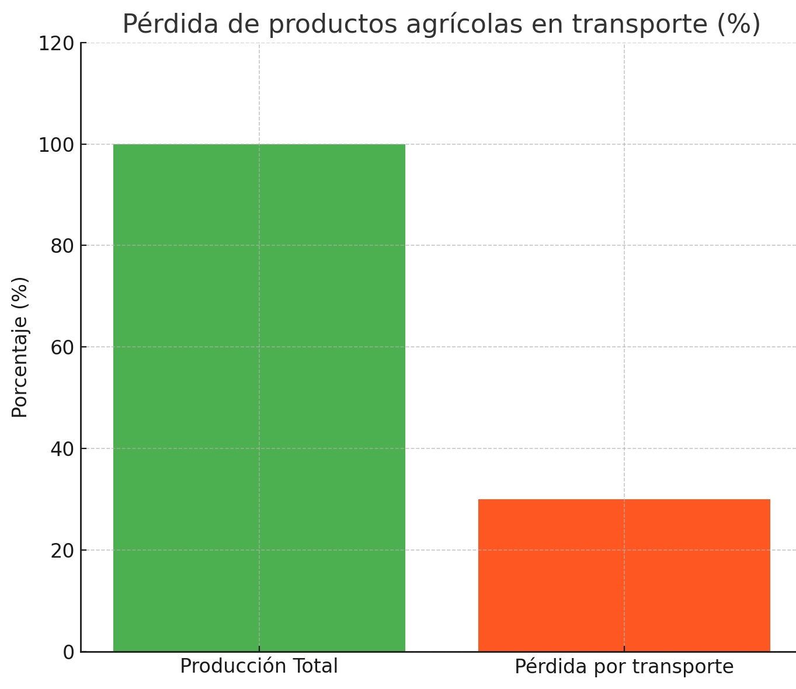
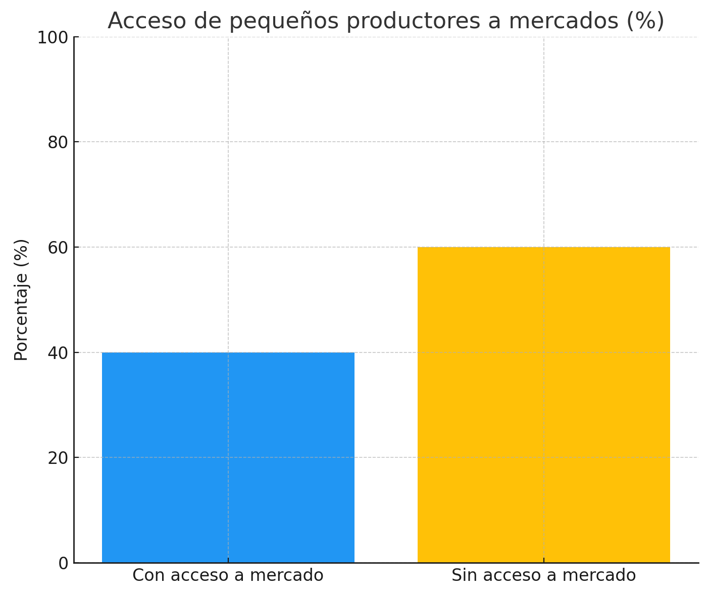

<h1 align="center">
<strong style="font-size:25px;">Universidad Informe de Trabajo Final</strong>
</h1>

---

<strong>Universidad Peruana de Ciencias Aplicadas</strong>

  

Ingenieria de Software

5to ciclo

---

<strong>Código: </strong>1ASI0730

<strong>Curso:</strong> Aplicaciones Web

<strong>Sección:</strong> 4381

<strong>Docente:</strong> Oscar Ivan Villafuerte Bazan

<strong>Proyecto:</strong> GreenLogist

## Integrantes:

| Nombres y Apellidos       | Codigo     |
|---------------------------|------------|
| Daniel Valdizan Grijalba  | u202311566 |
| Roy Fernández Remón       | u20221b778 |
| Oskar Rodrigo Sosa Soto   | u202212214 |
| Henry Kevin Diaz Gutierrez| u201819674 |
| Sebastián De Las Casas Latour | u202213553 |

Abril 2025

# Registro de Versiones del Informe

| Versión | Fecha | Autor | Descripción de modificación |
| :---- | :---- | :---- | :---- |
| 1.0 |  |  |  |
| 1.1 |  |  | |

# Project Report Collaboration Insights

## **TB1**

Para el desarrollo de la TB1 nos hemos dividido como equipo diferentes tareas para cada seccion del informe.

| Integrante          | Tareas Asignadas |
|:--------------------| :---- |
| Roy Fernández Remón |  |
|Oskar Rodrigo Sosa   |  |
|Henry Diaz Gutierrez |  |
|Daniel Valdizán Grijalba | Realización del capítulo 4 |
| Sebastián De Las Casas Latour | Realización del capítulo 5 |

# Tabla de contenidos

[Capítulo I: Introducción](#capítulo-i-introducción)
- [Registro de Versiones del Informe](#registro-de-versiones-del-informe)
- [Project Report Collaboration Insights](#project-report-collaboration-insights)
  - [**TB1**](#tb1)
- [Tabla de contenidos](#tabla-de-contenidos)
- [Student Outcome](#student-outcome)
- [Capítulo I: Introducción](#capítulo-i-introducción)
  - [1.1. Startup Profile](#11-startup-profile)
    - [1.1.1. Descripción de la Startup](#111-descripción-de-la-startup)
    - [1.1.2. Perfiles de integrantes del equipo](#112-perfiles-de-integrantes-del-equipo)
  - [1.2. Solution Profile](#12-solution-profile)
    - [1.2.1 Antecedentes y problemática](#121-antecedentes-y-problemática)
    - [1.2.2 Lean UX Process](#122-lean-ux-process)
      - [1.2.2.1 Lean UX Problem Statements](#1221-lean-ux-problem-statements)
      - [1.2.2.2 Lean UX Assumptions](#1222-lean-ux-assumptions)
      - [1.2.2.3 Lean UX Hypothesis Statements](#1223-lean-ux-hypothesis-statements)
      - [1.2.2.4 Lean UX Canvas](#1224-lean-ux-canvas)
  - [1.3. Segmentos Objetivo](#13-segmentos-objetivo)
- [Capítulo II: Requirements Elicitation \& Analysis](#capítulo-ii-requirements-elicitation--analysis)
  - [2.1. Competidores.](#21-competidores)
    - [2.1.1. Análisis competitivo.](#211-análisis-competitivo)
    - [2.1.2. Estrategias y tácticas frente a competidores.](#212-estrategias-y-tácticas-frente-a-competidores)
  - [2.2. Entrevistas.](#22-entrevistas)
    - [2.2.1. Diseño de entrevistas.](#221-diseño-de-entrevistas)
    - [2.2.2. Registro de entrevistas.](#222-registro-de-entrevistas)
    - [2.2.3. Análisis de entrevistas.](#223-análisis-de-entrevistas)
  - [2.3. Needfinding.](#23-needfinding)
    - [2.3.1. User Personas.](#231-user-personas)
    - [2.3.2. User Task Matrix.](#232-user-task-matrix)
    - [2.3.3. User Journey Mapping.](#233-user-journey-mapping)
    - [2.3.4. Empathy Mapping.](#234-empathy-mapping)
    - [2.3.5. As-is Scenario Mapping.](#235-as-is-scenario-mapping)
  - [2.4. Ubiquitous Language.](#24-ubiquitous-language)

# Student Outcome

| Criterio Especifico | Acciones Realizadas | Conclusiones |
| :---- | :---- | :---- |
|  |  |  |
|  |  |  |

# Capítulo I: Introducción

## 1.1. Startup Profile
En esta sección se describen los detalles del problema que buscamos resolver. Se detalla el perfil de la startup, el mercado objetivo, y se presentan la misión y visión. Asimismo, se expone una visión atractiva del equipo, resaltando su potencial en función de las habilidades y capacidades de cada integrante.

### 1.1.1. Descripción de la Startup
Greenlogist es una startup tecnológica dedicada a mejorar la eficiencia y sostenibilidad de la distribución de productos orgánicos en el Perú. Nuestra empresa ofrece una plataforma innovadora diseñada para optimizar el transporte entre pequeños agricultores locales y negocios como mercados, tiendas saludables y restaurantes eco-amigables.

Greenlogist conecta a productores orgánicos con transportistas y clientes de manera directa, permitiendo una recolección y entrega más eficiente, reduciendo costos, desperdicio y la huella de carbono. A través de nuestra plataforma, los agricultores podrán programar la recolección de sus productos y los negocios podrán coordinar entregas oportunas de alimentos frescos y de calidad.

La plataforma facilitará el registro de agricultores, clientes y transportistas, gestión de pedidos, programación de rutas, y seguimiento de entregas en tiempo real, asegurando una cadena de suministro transparente, segura y sostenible.

Este producto está dirigido principalmente a:

- Agricultores orgánicos locales que buscan alternativas logísticas accesibles.

- Tiendas saludables y restaurantes que requieren productos frescos con entregas confiables.

- Transportistas independientes que desean optimizar su carga y maximizar ingresos.

**Misión**

Nuestra misión es transformar la logística de productos orgánicos en el Perú, promoviendo el comercio justo, la sostenibilidad ambiental y el fortalecimiento de las economías locales, mediante soluciones tecnológicas innovadoras que conecten eficientemente productores y consumidores.

**Visión**

Nuestra visión es ser la principal plataforma de logística orgánica en América Latina, liderando la transición hacia un sistema de distribución agrícola más justo, eficiente y sostenible, donde cada productor local pueda acceder a los mercados de manera directa y segura.

### 1.1.2. Perfiles de integrantes del equipo
falta completar 

## 1.2. Solution Profile
En esta sección se describe el perfil de la solución teniendo en cuenta el problema y las ideas que se deben resolver para fomentar un sistema logístico seguro, eficiente y sostenible para productos orgánicos.

### 1.2.1 Antecedentes y problemática
En los últimos años, el crecimiento de la demanda de productos orgánicos ha sido evidente en el Perú y el mundo. Sin embargo, los pequeños agricultores enfrentan grandes retos logísticos: altos costos de transporte, falta de acceso a mercados urbanos, pérdidas de productos por demoras y la dependencia de intermediarios que reducen sus márgenes de ganancia.

Adicionalmente, muchos negocios que desean ofrecer productos orgánicos locales no cuentan con una cadena de suministro confiable que garantice la frescura y calidad de los productos.

Esta desconexión logística genera ineficiencias, incrementa los precios para los consumidores finales y limita las oportunidades de crecimiento económico de los pequeños productores.

Ante esta situación, surge la necesidad de una solución tecnológica que permita una conexión directa entre agricultores, transportistas y compradores, optimizando las rutas de recolección y entrega, mejorando la trazabilidad, reduciendo tiempos de traslado y fortaleciendo la economía local.

Es en este contexto que se propone Greenlogist, una plataforma digital que centraliza la gestión logística de productos orgánicos, permitiendo:

- La planificación eficiente de recolecciones desde los campos de cultivo.

- La conexión inmediata con transportistas disponibles.

- La organización de entregas a puntos de venta o consumo final de forma sostenible.

- El seguimiento de los pedidos en tiempo real para mayor transparencia y confianza.

**WHAT**

**¿Cuál es el problema?**

Actualmente, los pequeños agricultores en el Perú enfrentan serias dificultades en la distribución de sus productos orgánicos debido a la falta de soluciones logísticas adecuadas. Los altos costos de transporte, la falta de rutas eficientes, la pérdida de productos frescos por demoras y la dependencia de intermediarios afectan directamente su rentabilidad y acceso a mercados. Esto genera una cadena de suministro ineficiente, aumenta los precios al consumidor final y limita el crecimiento de los productores locales.

¿Cuál es la relación con la persona en cuestión?

Este problema afecta directamente a los agricultores orgánicos, pequeños productores rurales y a los negocios que buscan abastecerse de productos frescos, como tiendas saludables y restaurantes ecológicos. La falta de logística accesible y eficiente limita sus oportunidades de crecimiento y afecta la calidad del producto que llega al consumidor.

**WHEN**

**¿Cuándo sucede el problema?**

El problema ocurre constantemente, pero se agudiza en temporadas de cosecha, donde la necesidad de movilizar grandes volúmenes de productos perecibles es crítica. La ineficiencia logística impacta más durante estas épocas, provocando pérdidas económicas considerables.

**¿Cuándo utiliza el cliente el producto?**

Los usuarios utilizarán Greenlogist para programar recolecciones y entregas de productos agrícolas. Los agricultores coordinarán el transporte al momento de planificar su cosecha o venta, mientras que los negocios programarán sus pedidos de abastecimiento periódicamente según sus necesidades.

**WHERE**

**¿Dónde está el cliente cuando usa el producto?**

Los agricultores usarán la plataforma desde sus campos o centros de acopio, mientras que los clientes (mercados, tiendas, restaurantes) podrán gestionar pedidos desde sus establecimientos o cualquier lugar con acceso a internet.

**¿A dónde se dirige?**

La plataforma facilita la recolección desde las zonas rurales de producción hacia centros urbanos, donde se encuentran los principales mercados y consumidores finales.

**¿Dónde surge el problema?**

El problema surge en las zonas rurales y periurbanas, donde la falta de servicios logísticos especializados para productos frescos limita la llegada eficiente de alimentos a las ciudades. También afecta la última milla en las entregas urbanas, donde el tráfico y la falta de rutas optimizadas generan pérdidas.

**WHO**

**¿Quiénes están involucrados?**

Los principales involucrados son:

- Agricultores orgánicos y productores rurales.

- Transportistas independientes o pequeñas empresas de transporte.

- Negocios que demandan productos frescos (mercados, tiendas saludables, restaurantes).

- Consumidores conscientes que exigen productos locales y orgánicos de calidad.

**¿A quiénes le sucede el problema?**

Principalmente a los agricultores, quienes ven limitada su capacidad de comercialización y ganancia, y a los negocios que experimentan sobrecostos y falta de disponibilidad de productos frescos.

**¿Quién lo utilizará?**

GreenLogist será utilizado por:

- Agricultores que buscan distribuir su producción de manera más eficiente.

- Transportistas que deseen optimizar sus rutas y maximizar su ocupación.

- Negocios que requieren productos orgánicos frescos y confiables.

**WHY**

**¿Cuál es la causa del problema?**

La raíz del problema es la falta de infraestructura logística accesible para pequeños productores, la ineficiencia en la programación de rutas y la alta dependencia de intermediarios que encarecen el proceso de distribución. Además, no existen soluciones tecnológicas específicas que integren agricultores, transportistas y compradores de forma directa y ágil.

**HOW**

**¿En qué condiciones los clientes usan nuestro producto?**

Los agricultores utilizarán Greenlogist al momento de planificar la recolección de sus cosechas. Los transportistas accederán para aceptar y organizar las rutas de carga, mientras que los compradores utilizarán la plataforma para coordinar entregas periódicas o pedidos especiales de productos frescos.

**¿Cómo nos conocieron los compradores?**

Los clientes conocerán Greenlogist a través de:

- Campañas digitales en redes sociales enfocadas en agricultura sostenible.

- Alianzas estratégicas con asociaciones de agricultores y cámaras de comercio.

- Eventos de promoción en ferias de productos orgánicos y ecológicos.

**¿Cómo prefieren los lectores acceder a nuestro contenido?**

Los usuarios prefieren soluciones móviles y web de acceso sencillo, con notificaciones en tiempo real sobre el estado de las entregas, precios de rutas, disponibilidad de transportistas y calidad de productos.

**¿Qué llevó a la persona a llegar a esta situación?**

El incremento de costos logísticos, la pérdida de productos por demoras y la falta de acceso directo al mercado llevaron a los agricultores a buscar una solución eficiente y accesible que les permita competir en mejores condiciones.

**HOW MUCH** 

Incluir estadísticas que sustenten la problemática

Para sustentar la necesidad de una solución logística para productos orgánicos, 
se consultaron datos proporcionados por el Ministerio de Agricultura y Riego del Perú (MINAGRI) y la FAO.

**Figura 1:** Pérdida de productos agrícolas en el transporte

**\*Nota:** Gráfico N.º 1 Perdidas de productos en el transporte\*
**Fuente:** Ministerio de agricultura y Riego del Perú(MINAGRI, 2023)

Según el Ministerio de Agricultura y Riego del Perú (MINAGRI, 2023), se estima 
que entre un 25 % y 35 % de la producción agrícola nacional se pierde anualmente 
debido a problemas en la cadena de suministro, incluyendo transporte ineficiente.

**Figura 2:** Acceso a mercados de pequeños productores

**\*Nota:** Gráfico N.º 2 Acceso a mercados de pequeños productores\*
**Fuente:** Organización de las Naciones Unidas para la Alimentación y la Agricultura (FAO, 2023)

De acuerdo a la FAO (2023), menos del 40% de los pequeños productores en 
Perú tienen acceso directo a mercados urbanos, lo que limita gravemente sus ingresos y su capacidad 
de crecimiento económico.

El elevado porcentaje de pérdidas agrícolas y la falta de acceso a mercados demuestran 
la urgente necesidad de soluciones logísticas especializadas. Greenlogist 
se presenta como una respuesta innovadora, que no solo optimiza la 
distribución de productos frescos, sino que también fortalece la economía 
local y promueve un comercio más justo y sostenible.

### 1.2.2 Lean UX Process
La metodología Lean UX se enfoca en el usuario y en la validación constante de soluciones frente a una problemática. Tras identificar la necesidad de soluciones de logística sostenibles y responsables, consideramos adecuado aplicar esta metodología para diseñar un servicio que sea relevante y efectivo.

#### 1.2.2.1 Lean UX Problem Statements
En el Perú, el crecimiento del mercado de productos sostenibles enfrenta un obstáculo clave: la falta de servicios de logística adaptados a sus necesidades. Muchos productores verdes, artesanos y pequeñas marcas ecológicas no cuentan con medios adecuados para transportar sus productos de forma eficiente, accesible y alineada con sus valores de sostenibilidad.

Actualmente, los servicios logísticos convencionales no consideran la trazabilidad, la baja huella de carbono ni la particular sensibilidad que estos productos requieren (cuidado del empaque, rutas optimizadas, etc.), generando altos costos, demoras y riesgos de daño.

¿Cómo podríamos diseñar un servicio de logística sostenible que permita a productores eco-responsables movilizar sus productos de manera eficiente, segura, y con el menor impacto ambiental posible?

#### 1.2.2.2 Lean UX Assumptions
**Business Assumptions**

- Creemos que nuestros clientes necesitan un servicio de transporte especializado que comprenda las particularidades de los productos sostenibles.

- Esta necesidad puede cubrirse mediante un servicio logístico que utilice rutas optimizadas, vehículos eco-amigables y protocolos de manejo seguro de productos eco-friendly.

- El valor más importante que se espera de nuestro servicio es la confiabilidad y el compromiso con la sostenibilidad, seguido de tarifas competitivas.

-  Planeamos adquirir la mayoría de nuestros clientes mediante alianzas con ferias verdes, tiendas ecológicas, asociaciones de productores y marketing digital orientado al consumo responsable.

- Nuestra competencia directa son las empresas de courier tradicionales y algunos operadores logísticos locales, pero estas no priorizan sostenibilidad ni personalización para productos ecológicos.

- Superaremos a la competencia ofreciendo un enfoque 100% verde: rutas optimizadas para reducir emisiones, empaques retornables, reportes de huella de carbono y atención especializada.

- El mayor riesgo de nuestro servicio es la percepción de ser más costoso que la logística convencional.

- Este riesgo será mitigado mediante tarifas escalables, beneficios fiscales (cuando aplique) y comunicación del impacto positivo generado.

- La confianza en la plataforma aumentará mostrando métricas de sostenibilidad (reducción de emisiones, entregas exitosas, etc.) y casos de éxito.

- La satisfacción del cliente también se mejorará mediante seguimiento personalizado y feedback post-servicio.

**User Assumptions**

- ¿Quién es el usuario?

Productores sostenibles, ferias ecológicas, marcas locales de productos verdes, y tiendas eco-friendly que necesitan soluciones logísticas alineadas a sus valores.

- ¿Dónde encaja nuestro servicio en su vida?

En la operación diaria o periódica de su negocio: envío a tiendas, entrega a consumidores finales, abastecimiento a ferias o eventos de sostenibilidad.

- ¿Qué problemas tiene nuestro servicio y cómo se pueden resolver?

Preocupaciones por los costos, el tiempo de entrega y el cuidado del producto durante el transporte. Se resolverán mediante optimización de rutas, opciones de agrupamiento de envíos y empaques especiales.

- ¿Cuándo y cómo es usado nuestro servicio?

Greenlogist será utilizado para transportar productos en cargas individuales o consolidadas, a nivel local o regional, priorizando horarios estratégicos y minimizando tiempos de espera.

- ¿Qué características son importantes?

Optimización de rutas para reducir huella de carbono, uso de vehículos eco-friendly, cuidado especializado de productos, flexibilidad de tarifas, y reportes de sostenibilidad por envío.

- ¿Cómo debe verse nuestro producto (servicio) y cómo debe comportarse?

Debe transmitir confiabilidad, profesionalismo y compromiso ecológico. Desde la identidad visual hasta la experiencia de contacto y seguimiento del envío, todo debe ser claro, accesible, y eco-consciente.

**Features**

- Optimización de rutas y agrupamiento de envíos sostenibles.

- Sistema de seguimiento de entregas en tiempo real.

- Transporte en vehículos eléctricos, híbridos o de bajas emisiones.

- Empaque ecológico opcional (reutilizable o compostable).

- Reporte de huella de carbono para cada cliente.

- Soporte especializado y asesoría en embalaje sostenible.

- Programas de fidelización para clientes recurrentes.

#### 1.2.2.3 Lean UX Hypothesis Statements
- Creemos que los productores sostenibles preferirán un servicio logístico especializado si garantizamos reducción de emisiones, cuidado de productos y tarifas competitivas. Sabremos que hemos tenido éxito cuando el 30% de los productores recurran a nosotros de manera recurrente.

- Creemos que los consumidores valorarán más los productos verdes si aseguramos entregas limpias y responsables. Sabremos que hemos tenido éxito cuando las marcas que utilicen nuestro servicio reporten un 20% de mejora en la percepción de sus clientes.

- Creemos que reduciremos la huella ambiental del transporte de productos sostenibles si implementamos rutas inteligentes y vehículos eco-friendly. Sabremos que hemos tenido éxito cuando podamos demostrar un 25% menos de emisiones por envío comparado con servicios convencionales.

#### 1.2.2.4 Lean UX Canvas
**1. Problema de negocios**

Los productores y negocios sostenibles enfrentan barreras logísticas para movilizar sus productos de manera coherente con sus valores. No existe un servicio logístico especializado en sostenibilidad, eficiente y accesible en el mercado.

Greenlogist busca resolver esta necesidad, ofreciendo un transporte responsable, especializado y medible en su impacto ambiental.

¿Cómo podemos crear un servicio de logística sostenible, que facilite el crecimiento de los negocios verdes y refuerce la confianza en sus prácticas responsables?

**2. Resultados comerciales**

Incremento de la demanda de transporte sostenible.

Reducción de huella de carbono en la cadena de suministro de nuestros clientes.

Posicionamiento de Greenlogist como líder en logística ecológica.

Generación de ingresos mediante servicios de transporte, consultorías en sostenibilidad logística y membresías para clientes frecuentes.

**3. Usuarios y Clientes**

Productores sostenibles, tiendas eco-friendly, marcas verdes, ferias y eventos ecológicos que requieren transporte responsable.

**4. Beneficios del usuario**

Ahorro de tiempo y costos gracias a rutas optimizadas.

Mejora en la percepción de su marca al utilizar transporte sostenible.

Reducción de la huella de carbono asociada a sus operaciones.

Aseguramiento del cuidado y calidad de los productos en el traslado.

**5. Soluciones**

Diseño de rutas agrupadas para reducir emisiones y costos.

Uso de flotas de bajas emisiones o vehículos eléctricos.

Embalajes sostenibles y retornables para envíos.

Herramientas de tracking de envíos y métricas de sostenibilidad.

**6. Hipótesis**

Creemos que los productores utilizarán Greenlogist si ofrecemos precios competitivos y aseguramos entregas cuidadosas y sostenibles.

Creemos que las tiendas y marcas verdes valorarán nuestro servicio si mostramos claramente el impacto positivo de cada envío en términos de emisiones reducidas.

**7. ¿Qué es lo más importante que necesitamos aprender primero?**

Identificar las zonas de mayor concentración de productores verdes.

Entender las necesidades específicas de transporte sostenible de cada tipo de cliente (volúmenes, frecuencia, cuidado especial).

Conocer la sensibilidad de los clientes frente al precio versus valor de la sostenibilidad.

**8. ¿Cuál es la menor cantidad de trabajo que necesitamos para hacer lo siguiente más importante?**

Realizar encuestas y entrevistas rápidas con productores sostenibles.

Pilotear rutas optimizadas en zonas estratégicas.

Probar un sistema básico de tracking y medición de huella de carbono. 

## 1.3. Segmentos Objetivo
**Segmento 1: Productores de productos sostenibles**

- Características Demográficas:

Edad: 18 a 60 años.

Nacionalidad: Peruana.

Ubicación: Principalmente áreas rurales, semiurbanas y urbanas en crecimiento.

Nivel educativo: Secundaria completa, estudios técnicos o universitarios (en áreas como agroindustria, comercio, sostenibilidad, etc.).

Intereses: Expansión de su mercado, reducción de costos de transporte, prácticas responsables con el medio ambiente.

- Características Psicográficas:

Emprendedores y pequeñas empresas que producen alimentos orgánicos, artesanías sostenibles, textiles ecológicos, cosmética natural, etc.

Buscan formas eficientes y respetuosas con el medio ambiente para transportar sus productos a ferias, mercados, y tiendas.

Valoran alianzas con empresas que refuercen su imagen de compromiso ecológico y responsabilidad social.

Sensibles a la trazabilidad y certificación de procesos sostenibles.

**Segmento 2: Personas que buscan productos orgánicos de calidad en casa**

- Características Demográficas:

Edad: 18 a 60 años.

Nacionalidad: Peruana.

Ubicación: Principalmente en áreas urbanas (Lima, Arequipa, Trujillo, Cusco) y suburbanas.

Nivel educativo: Diverso .

Intereses: Alimentación saludable, productos orgánicos frescos, comercio justo, consumo responsable.

- Características Psicográficas:

Personas conscientes de la importancia de consumir productos frescos y sostenibles.

Prefieren comprar directamente a productores locales, pero tienen dificultades para acceder a ellos debido a la distancia o falta de tiempo.

Valoran servicios que garanticen calidad, trazabilidad y entrega eficiente de productos agrícolas.

Buscan conveniencia: recibir productos frescos en casa o en puntos cercanos de entrega, sin complicaciones.

Se interesan por iniciativas que apoyan la economía local y reducen el impacto ambiental.

# Capítulo II: Requirements Elicitation & Analysis

## 2.1. Competidores.

### 2.1.1. Análisis competitivo.
Actualmente, el mercado logístico peruano cuenta con varios actores, pero pocos están alineados con las necesidades específicas del segmento ecológico. A continuación, se presenta un análisis de los principales competidores directos e indirectos:

### 2.1.2. Estrategias y tácticas frente a competidores.

## 2.2. Entrevistas.

### 2.2.1. Diseño de entrevistas.

### 2.2.2. Registro de entrevistas.

### 2.2.3. Análisis de entrevistas.

## 2.3. Needfinding.

### 2.3.1. User Personas.

### 2.3.2. User Task Matrix.

### 2.3.3. User Journey Mapping.

### 2.3.4. Empathy Mapping.

### 2.3.5. As-is Scenario Mapping.

## 2.4. Ubiquitous Language.
