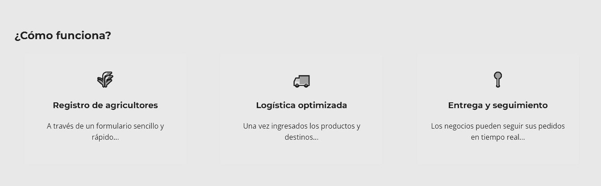
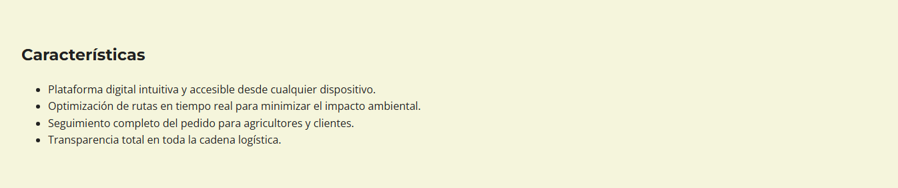

# Capítulo IV: Product Design
## 4.1. Style Guidelines
### 4.1.1. General Style Guidelines
El diseño visual de Greenlogist debe reflejar sus valores fundamentales: sostenibilidad, eficiencia, confianza y conexión directa entre productores y consumidores conscientes. Adicionalmente, deberá presentar un diseño limpio, con espacios amplios, buena jerarquía visual, alto contraste en botones, textos legibles, íconos comprensibles y una estética amigable pero profesional.

### **Colores**
Los colores escogidos para este producto fueron: Un Verde Natural (#4CAF50) como color principal, el cual refleja sostenibilidad, frescura y es fuertemente asociado con el campo; Beige claro (#F5F5DC) para el fondo de la página; Gris suave (#E0E0E0) para elementos secundarios de la página; Verde oscuro (#2E7D32) para los botones y elementos llamativos; y Negro (#212121) para la tipografía.

### **Tipografía**
Para la tipografía de la página se eligió Montserrat Bold para los titulares, esto debido a su caracter moderno y a que facilita la legibilidad para el usuario. Asimismo, se hará uso de la tipografía Open Sans Regular para el cuerpo del texto debido a sus accesibilidad. 

### **Tono y comunicación**
La página debe presentar un tono claro, sencillo y positivo, que refleja la personalidad de la marca (confiable, accesible, moderna y comprometida con el cambio). Asimismo, el tono debe estar enfocado en los beneficios del comercio justo, el respeto por el medio ambiente y la colaboración entre actores.

### **Iconografía**
Se emplearán íconos lineales, y minimalistas, relacionados a la agricultura, transporte, geolocalización, sostenibilidad, calificación y contacto.Es importante priorizar su uso moderado para no saturar visualmente, pero sí facilitar la comprensión rápida de funciones.

### 4.1.2. Web Style Guidelines
Las guías de estilo web de Greenlogist aseguran una experiencia visual y funcional coherente, centrada en la usabilidad, accesibilidad y conexión con el usuario. Se alinean con los principios de diseño sostenible, simplicidad funcional y diseño centrado en el usuario.

Se empleará un diseño basado en grid de 12 columnas para flexibilidad y adaptabilidad responsiva.

Asimismo, se deberán asegurar márgenes amplios y separación clara entre secciones para evitar saturación visual.

Adicionalmente, el encabezado siempre visible con logo, buscador, categorías y acceso rápido a cuenta/perfil, y se debe establecer un pie de página con enlaces a contacto, redes sociales y certificado de sostenibilidad.

## 4.2. Information Architecture
### 4.2.1. Organization Systems

### 4.2.1. Labeling Systems

### 4.2.1. SEO Tags and Meta tags

### 4.2.1. Searching Systems

### 4.2.1. Navigation Systems

## 4.3. Landing Page UI Design
### 4.3.1. Landing Page Wireframe

### 4.3.1. Landing Page Mockup

